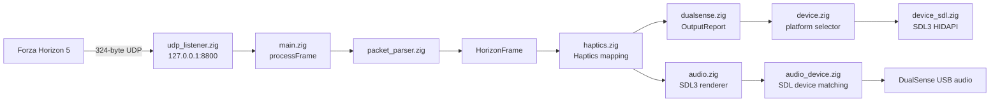
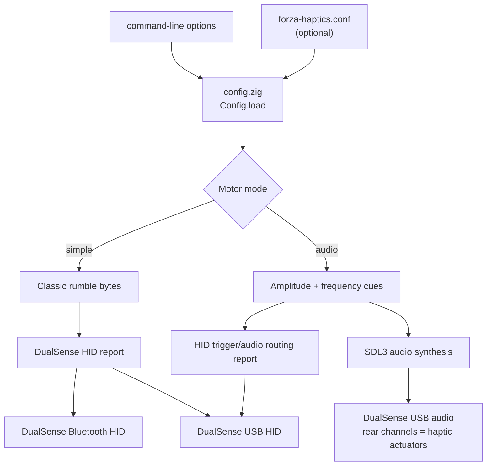

# horizon-dualsense-haptics

`horizon-dualsense-haptics` is a Zig application that converts Forza Horizon
telemetry into haptic feedback for a Sony DualSense controller. It listens for
the game's 324-byte UDP telemetry packets, maps wheel, brake, gear, and engine
events to controller effects, and sends those effects through the DualSense
USB or Bluetooth HID interface.

The project supports two motor backends:

- `simple`: classic DualSense rumble reports. This works with a controller
  connected over USB or Bluetooth.
- `audio`: synthesized 4-channel audio sent to the DualSense USB audio device;
  the rear channels drive the left and right haptic actuators.

The device layer uses SDL3 HIDAPI for controller reports on Linux and Windows,
while SDL3 provides the audio backend.

## Architecture

The live application processes one telemetry datagram at a time. The parser
turns the fixed 324-byte packet into a typed `HorizonFrame`; the haptics layer
then derives trigger, rumble, and audio effects from that frame.



The selected motor backend determines how the mapped effects reach the
controller. Simple mode uses classic HID rumble bytes and works over USB or
Bluetooth. Audio mode sends synthesized four-channel USB audio; HID reports
are still used for trigger effects and audio routing flags.



Audio mode requires USB because the haptic audio stream is a USB audio
device. The `--bluetooth` option selects simple mode instead.

## Requirements

- Zig 0.16.0 or newer
- A DualSense or DualSense Edge controller connected over USB or Bluetooth
- For audio mode, a USB connection to the controller and an SDL3-visible audio
  device
- For Linux, permission for SDL HIDAPI to access the controller

The SDL3 dependency is fetched automatically by Zig from `build.zig.zon`.

## Build

Run these commands from the project directory:

```sh
zig build --fetch
zig build
zig build test
```

The executable is written to:

```text
zig-out/bin/horizon-dualsense-haptics
```

Use `-Doptimize=ReleaseFast` for an optimized build:

```sh
zig build -Doptimize=ReleaseFast
```

## Use

Configure Forza Horizon to send telemetry to `127.0.0.1:8800`, then run:

```sh
zig build run
```

The application reads `forza-haptics.conf` from the current working directory
if it exists. Command-line options override values from that file:

```ini
motor-mode=audio
audio-gain=0.75
audio-sink=dualsense
```

The available options are:

```text
--motor-mode simple|audio   Select the haptic backend
--bluetooth                 Force simple rumble mode and disable USB audio
--audio-sink <substring>    Select the matching SDL audio device
--audio-gain <0..1>         Set audio output gain
--ip-address <address>      IP address to receive telemetry (default 127.0.0.1)
--port <port>               UDP port to receive telemetry (default 8800)
--save-packets              Save received packets under data/
--capture-count <n>         Save up to n packets (implies --save-packets)
--record-only               Record packets without initializing audio or HID
--selftest                  Parse a bundled packet and print its fields
--replay                    Replay bundled data/packet-*.udp captures
--loop                      Repeat replay mode indefinitely
--speed <factor>            Scale replay speed; 1.0 is the captured rate
--audio-test [0..3]         Emit a test tone on one audio channel
```

Examples:

```sh
# Use classic rumble without a configuration file.
zig build run -- --motor-mode simple

# Listen on all local interfaces and UDP port 8810.
zig build run -- --ip-address 0.0.0.0 --port 8810

# Capture exactly the first 100 telemetry packets while running.
zig build run -- --capture-count 100

# Capture packets without requiring a controller or audio device.
zig build run -- --record-only --capture-count 100

# Use a Bluetooth controller; this automatically disables audio mode.
zig build run -- --bluetooth

# Replay the checked-in telemetry captures through the controller.
zig build run -- --replay

# Replay captures through a Bluetooth controller.
zig build run -- --bluetooth --replay

# Replay at half speed and repeat until interrupted.
zig build run -- --replay --loop --speed 0.5

# Test one audio channel in audio mode.
zig build run -- --motor-mode audio --audio-test 2
```

The process listens continuously for telemetry. Stop it with `Ctrl-C`.

## License

This project is licensed under the GNU Affero General Public License, version
3 or later. See [LICENSE](LICENSE).
